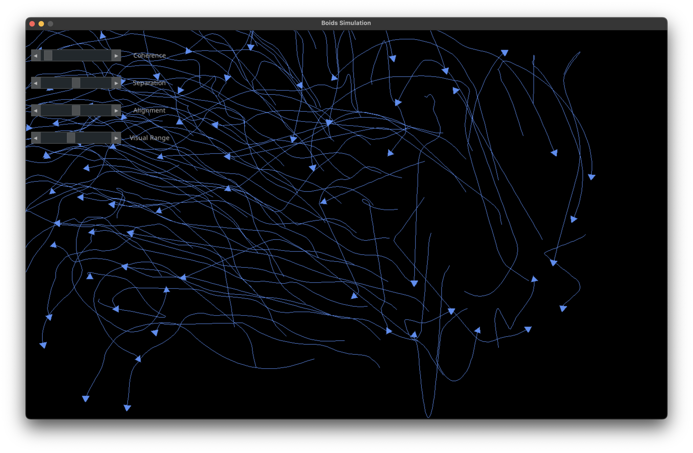

# Boids Simulation

Simulating flocking behavior of birds using the Boids Algorithm

Video demonstration [here](https://www.youtube.com/watch?v=zZ3n-WtWS0M)

# Reference

[Boids algorithm - augmented for distributed consensus](https://vanhunteradams.com/Pico/Animal_Movement/Boids-algorithm.html)
